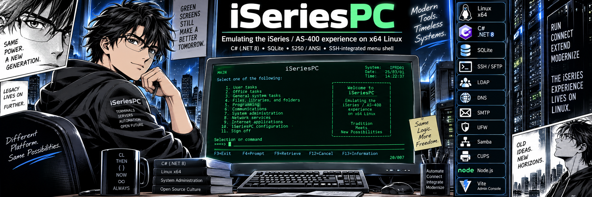

# iSeriesPC

Emulation of the IBM iSeries/AS-400 experience on x64 Intel Linux, implemented in C# (.NET 8)
over SQLite, with host-level integrations for SSH/SFTP, LDAP, DNS, SMTP, UFW, Samba, CUPS,
Node.js and a Vite admin console.

The SSH login shell is replaced by an iSeries-style menu interface (`AS400Menu`) with a full
5250/ANSI full-screen experience: sign-on, menus, CL command line, prompting (F4), help (F1),
function keys, subfiles and paging.

## Status

Under construction. See [PLAN.md](PLAN.md) for the master task list and the tracked
[compatibility matrix](docs/compatibility-matrix.md) for requirement-level status.
The verified original baseline is 223 passing tests; package completion requires
the additional acceptance criteria in the plan.

Latest [completion checkpoint](docs/completion-progress.md): 33/106 checklist items
complete, 998 tests passing, and real sign-on/display PTY acceptance passing.

| WP | Component | Status |
|----|-----------|--------|
| WP0 | Foundation | build baseline verified |
| WP1 | Ipc.Core domain model | partial — see compatibility matrix |
| WP2 | Ipc.Services host (SQLite, config, logging, events, IpcSystem) | partial — see compatibility matrix |
| WP3 | Security engine | partial — see compatibility matrix |
| WP4 | Job/work-management engine | partial — see compatibility matrix |
| WP5 | Terminal + display engine (ANSI 5250, fields) | partial — see compatibility matrix |
| WP6 | Session host (as400menu) + sign-on | partial — see compatibility matrix |
| WP7 | Menus system (MAIN/MAJOR, GO, *MENU objects) | partial — see compatibility matrix |
| WP8 | CL command system + interpreter (*CMD catalog, CRTCLPGM, CALL, command line) | partial — see compatibility matrix |
| WP9 | DDS compiler + SQLite file store (*FILE objects, members, record codec, CRTSRCPF/ADDSRCPFM/CRTPF/DSPPFM/ADDPFM/CPYF/DLTF) | partial — see compatibility matrix |
| WP10 | RPG compiler + interpreter (fixed + free form, `/free` directives, data structures, expressions + `%` built-ins, file I/O, subroutines, subprocedures P/D + CALLP, prototypes PR/PARMs + `PROCPTR`, `CALL`/`CALLP` with PLIST + updated-parameter writeback, `ON-ERROR`/`*INLR`, messaging) | partial — see compatibility matrix |

## Layout

This is the target layout; the compatibility matrix distinguishes implemented and planned components.

- `src/Ipc.Core` — domain model: objects, libraries, authorities, system values, CCSID, dates, *MENU objects
- `src/Ipc.Services` — job engine, spool engine, security, menu store, IFS, save/restore, messaging, journals
- `src/Ipc.Db` — SQLite catalog, DDS compiler, SQL bridge, SQL tools
- `src/Ipc.Cl` — command catalog, parser, prompt, CL program interpreter
- `src/Ipc.Rpg` — RPG interpreter (fixed + free form)
- `src/Ipc.Dsp` — DSPF compiler + panel/subfile runtime
- `src/Ipc.Terminal` — ANSI 5250 renderer + input editor
- `src/Ipc.Console` — `AS400Menu` SSH login-shell host + sign-on
- `src/Ipc.Api` — system API runtime (QCMDEXC, QMHSNDM, QUS*, ...)
- `src/Ipc.Session` — shared controllers, command orchestration, and terminal session transport
- `src/Ipc.Server` — `as400server` catalog/session owner
- `src/Ipc.Web` — ASP.NET Core REST + IWS-style program services + 5250-over-websocket
- `src/Ipc.WebUi` — Vite SPA admin console
- `src/Ipc.Bridge` — interop/migration CLI
- `src/Ipc.Installer` — provisioning + first-run wizard + systemd

See `docs/*` for architecture, object model, and command/RPG/DDS specifications.

## Build & test

```
dotnet restore iSeriesPC.sln --locked-mode
dotnet build iSeriesPC.sln --no-restore -c Release
dotnet test iSeriesPC.sln --no-build -c Release
```

Build with SDK 8.0.425 (pinned in `global.json`). See [build/runtime policy](docs/build-baseline.md).

## Run the shared terminal host

```sh
dotnet run --project src/Ipc.Server -c Release -- --data-dir /path/to/instance
# In another terminal, under the same OS account:
dotnet run --project src/Ipc.Console -c Release -- --data-dir /path/to/instance
```

`as400menu` connects to the shared server by default. `--server SOCKET` selects an
explicit Unix socket; `--standalone` keeps the embedded development mode. Use
`--migrate-only` for [catalog migration and recovery](docs/catalog-migrations.md).
New catalogs generate a private initial-password file; see [authentication and recovery](docs/authentication.md).
The socket defaults to owner-only, with explicit group access configuration. Real SSH/PAM
integration is tested; multi-account host provisioning and full web/batch feature delivery remain open;
this is not yet a production deployment. See [architecture](docs/architecture.md).
