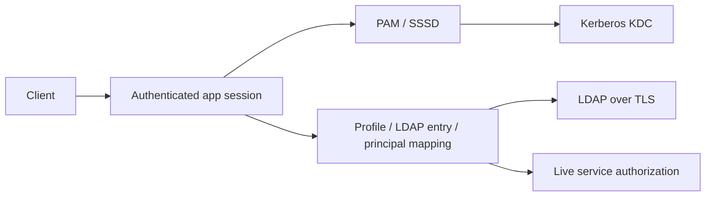

# Kerberos, SSSD and enterprise identity mappings

Enterprise profiles authenticate through Linux-PAM/SSSD with Kerberos as SSSD's
authentication provider and LDAP as its identity provider. The app verifies the
LDAP identity binding independently before authentication and during live-session
operation. This release path accepts a password through the existing terminal,
HTTP or headless transport; it is not a browser SPNEGO endpoint or ticket-delegation
API. SSO session/token issuance has its own C03/C16 tasks.



## Durable mapping contract

Schema 10 stores mappings in `sys_eim_mappings` with transactional audit events.
A mapping links one non-system profile to one directory entry, Kerberos principal
and Linux account. Profile, principal and Linux account are unique. Within a
configured directory, both the immutable entry ID and distinguished name are
unique. Conflicts abort the entire write, preserving existing credentials.

| Field | Meaning |
|---|---|
| PROFILE | Existing iSeriesPC profile |
| DIRECTORY | Named directory from private system configuration |
| DN | Exact LDAP distinguished name to read |
| ENTRYID | Immutable LDAP identity, normally entryUUID |
| PRINCIPAL | Exact realm-qualified Kerberos principal |
| ACCOUNT | Linux/SSSD account name |

LDAP reads use base scope and do not follow referrals. The entry ID, account name,
principal attribute and explicit enabled value must match. A deleted/recreated
entry at the same DN fails the entry-ID check. Missing attributes, disabled entries,
principal changes and unavailable providers deny access. The app does not guess
identity from a matching display name, email prefix or case-folded username.

A mapping removes the old local password hash. Direct PAM configuration and EIM
cannot both select the same profile; such ambiguity denies sign-on. EIM uses the
SSSD/Kerberos credential exclusively, with no local-password fallback. Local
profile disable/expiry remains an independent denial. Shipped system profiles
cannot be mapped, preserving a local recovery administrator.

Removing a mapping also disables its profile in the same transaction. Recreating
the mapping does not reactivate a disabled profile. A security administrator must
explicitly recover it. Mapping changes require SECADM and cannot change the
executing administrator's own mapping. Use another local administrator for those
changes. Read access follows the profile administration boundary.

## Configuration and commands

Example `system.json` fragment:

```json
{
  "Authentication": {
    "SssdPamService": "iseriespc-sssd",
    "Directories": [{
      "Name": "corporate",
      "Uri": "ldaps://ldap.example.test",
      "TrustedCertificatesDirectory": "/etc/iseriespc/directory-ca",
      "EntryIdAttribute": "entryUUID",
      "PrincipalAttribute": "krbPrincipalName",
      "LinuxAccountAttribute": "uid",
      "EnabledAttribute": "employeeType",
      "EnabledValue": "active"
    }]
  }
}
```

Directory configuration is loaded at server start. Attribute names and enabled
values are explicit site contracts; the defaults target an OpenLDAP/SSSD setup.
Directories exposing another schema must configure matching attributes. An unreadable
or absent enabled attribute denies access. Configure the same enabled-state policy
in SSSD's account/access provider. AD's userAccountControl bit field is not interpreted
by this adapter; use an explicit supported status attribute/mapping.

LDAPS is required. Linux CA directories use PEM files indexed with `openssl rehash`;
the adapter creates a new native TLS context after setting the directory. Server
chain and hostname verification remain enabled. The only plaintext exception is
an explicit `AllowLoopbackPlaintext: true` with a literal loopback IP, for isolated
fixtures. Anonymous reads are explicit when no bind DN is configured. Otherwise,
provide both `BindDistinguishedName` and `BindPasswordFile`; the password file must
be private, nonempty, at most 4 KiB and not a symlink. Its contents never enter JSON
configuration or audit events.

Provision the Linux host's PAM/SSSD configuration separately. The PAM service uses
`pam_sss.so` for both authentication and account checks. SSSD uses `id_provider=ldap`,
`auth_provider=krb5`, `krb5_validate=true`, an appropriate host keytab, and
`cache_credentials=false`. Configure the realm, KDC, TLS trust, LDAP principal
attribute and account-access filter for the site. The app never edits a host's
SSSD configuration or creates production realm principals during authentication.

The following iSeriesPC extension commands use the shared guarded service:

```text
ADDEIMMAP PROFILE(ALICE) DIRECTORY(corporate) DN('uid=alice,dc=example,dc=test') ENTRYID('entryUUID-from-directory') PRINCIPAL('alice@EXAMPLE.TEST') ACCOUNT(alice)
DSPEIMMAP PROFILE(ALICE)
RFREIMMAP PROFILE(ALICE)
RMVEIMMAP PROFILE(ALICE)
```

ADDEIMMAP stores the mapping and reports its initial directory state. An unavailable
or mismatched identity remains blocked until corrected and verified. DSPEIMMAP
accepts `PROFILE(*ALL)` or no profile to list mappings. Changing identity fields
requires removing and re-adding the mapping, followed by explicit profile recovery;
there is no silent reassignment of an existing identity.

## Revocation and failures

New sign-ons require a live directory check. A host-owned worker refreshes mappings
every 30 seconds, and guarded operations reject directory evidence older than
60 seconds. Disabled or unavailable state denies the next protected operation on
an existing session. Slow/unavailable directories may make evidence expire sooner
than a refresh finishes; access stays closed. No offline grace period is implied
by SSSD's identity cache. Provider credential caching must remain disabled in the
supported SSSD configuration.

Mapping revisions reject results from removed/replaced mappings. Probe start times
prevent an older response from overwriting a newer revocation. Native directory
operations have five-second transport timeouts; cancellation is checked before a
probe writes back. The refresh worker is cancelled on host shutdown. Job cleanup
still works after revocation, through the existing owned-session cleanup boundary.

## Verification

`EimMappingTests` covers conflicts, stale evidence/responses, administrator guards,
no local fallback, removal, and direct service denial after directory changes.
Migration tests include upgrades from schema 9. The native LDAP client is pinned
to System.DirectoryServices.Protocols 10.0.12, which supports this .NET 8 application.

`python3 tools/kerberos-smoke.py --dotnet /path/to/dotnet` builds an isolated Ubuntu
24.04 fixture with real MIT Kerberos, OpenLDAP TLS and SSSD. It runs without external
network access, published ports or host authentication changes; application/runtime
mounts are read-only and credentials live in an ephemeral container filesystem.
The test verifies a real TGT, NSS identity lookup, PAM/SSSD app login, certificate
hostname rejection, principal mismatch, automatic live-account revocation, KDC and
LDAP outages, mapping removal and credential-free audit. It does not qualify an
existing production directory, AD schema, host enrollment or installer.

The integration follows [SSSD's provider architecture](https://sssd.io/docs/introduction.html),
[LDAP/Kerberos configuration](https://github.com/SSSD/sssd/blob/master/src/examples/sssd-example.conf)
and the [.NET Linux LDAP TLS context contract](https://github.com/dotnet/runtime/blob/v10.0.12/src/libraries/System.DirectoryServices.Protocols/src/System/DirectoryServices/Protocols/ldap/LdapSessionOptions.Linux.cs).
